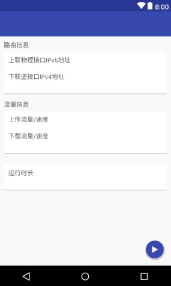
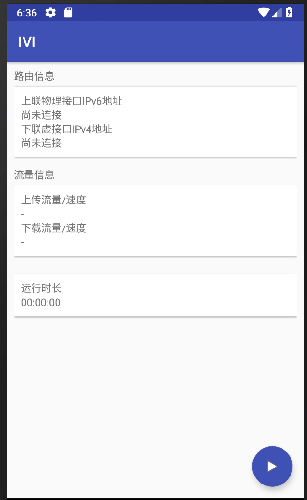
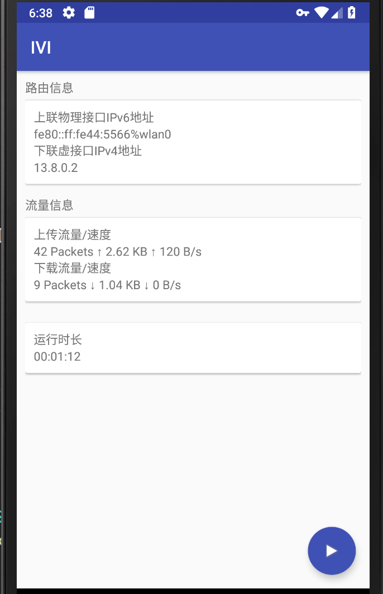
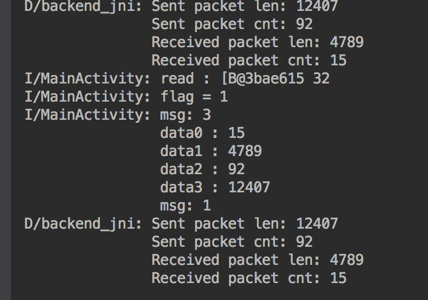

##IPV4 over IPV6隧道协议实验 实验报告

#### 组员：

##### 于志竟成 2015011275

##### 何欣蔚 2015011253

### 一、概述

#### 实验原理

IPv6是下一代互联网协议，它的设计以解决IPv4中的许多问题（最重要的一个就是解决了IP地址不够分配的问题）为目标。但是，在互联网大规模支持IPv6之前，IPv4到IPv6如何平滑过渡是需要人们仔细考虑的一个问题。例如，由于互联网服务提供商的现有网络设备大部分都只支持IPv4，我们有必要设计一种机制允许IPv6用户访问历史遗留的IPv4服务，而4over6就是这样的一种机制。

4over6其实就是一个典型的隧道协议：IPv6网络中的用户在希望访问IPv4服务时，将IPv4包封装在IPv6包中发送给一台能够直接访问IPv4服务的服务器。该服务器将进行实际IPv4资源的访问，然后再将得到的IPv4响应封装在IPv6包中发送回用户。为了能够通过IPv4地址将IPv4响应返回给相应的用户，4over6服务器需要维护一个IPv4和IPv6地址的映射表并为需要4over6服务的用户分配IPv4地址。

在Android设备上进行实现时，可以利用VPNService。在开启并配置好VPNService后，所有发向实际网络接口的包都会被重定向至`tun`虚接口。只需要从`tun`读取数据就可以拦截得到所有应用的网络流量，再将这些数据包装成上网请求消息通过IPv6发送给服务器就可以实现通过4over6隧道发送IPv4数据。接收服务器发来的上网回应消息，再将该消息中的数据写入`tun`虚接口，就可以实现通过4over6隧道接收IPv4数据。如此，我们可以利用VPNService在Android设备上实现对应用程序和互联网服务程序完全透明的4over6隧道。

#### 实验内容

在安卓设备上实现一个4over6隧道系统的客户端程序，内容如下：

- 实现安卓界面程序，显示隧道报文收发状态(java语言)；
- 启用安卓VPN服务(java语言)；
- 实现底层通信程序，对4over6隧道系统控制消息和数据消息的处理(C语言)。

#### 分工

* 于志竟成：后台的实现
* 何欣蔚：前台的实现

### 二、前台

前台主要实现安卓界面程序，显示隧道报文收发状态，主要用java语言实现。其功能大致能概述如下：

- 进行网络检测并获取上联物理接口IPV6地址；
- 启动后台线程；
- 开启定时器刷新界面；
- 界面显示网络状态；
- 开启安卓VPN服务。

主要的模块分为主模块（界面显示、定时器逻辑），VPN服务模块和界面文件 `activity_ivi.xml` .

#### 主模块（IVI）

前台的主体逻辑主要在 `IVI.java` 中实现，这也是整个Android app的主界面 `AppCompatActivity` .

前台主模块（IVI）中，获取IPV6地址的功能由函数 `getLocalHostIp()` 完成，activity中还定义了名为 `mTimer` 的 `Timer` 定时器，定时器的循环判断和数据读取功能由 `timerTask()` 函数完成，定时器线程和主线程的沟通以及对于网络信息数据的处理显示主要在名为 `mHandler` 的 `Handler` 中完成，开启安卓VPN服务的功能则主要通过唤起后台服务 `mVPNService` 来实现，这一点会在后面的部分详细提及。

下面对主模块中最重要的 `mTimer` ，`timerTask()` 和 `mHandler` 做较为细致的介绍。

##### mTimer 和 timerTask()

`mTimer` 是一个 `Timer` 定时器，通过语句 `mTimer = new Timer()` 来声明和构造，它的详细定义和功能则在函数 `timerTask()` 中得到定义。

`timerTask()` 中，通过调用 `mTimer.schedule(new TimerTask() {...}, 1000, 1000)` 来为定时器 `mTimer` 的功能逻辑做详细定义。其中主要重载了函数 `run()` ，在其中实现了循环逻辑判断和计时的功能。

主模块IVI activity中的变量 `int flag` 是函数逻辑判断的依据。当定时器刚刚运行时，`flag` 置0，表示尚未从后台读取到IP地址信息，这种情况下，定时器线程每循环一次，都试图从前后台通信的管道中读取20字节长的ip地址信息，并向主线程中的 `mHandler` 发送一个 `what` 为“2”的空白信息，提示主线程需要试图解析数据中的ip地址信息。若ip地址信息成功得到解析且非全0，则主线程将 `flag` 置1，主线程依据获得的ip地址信息开启后台VPN服务，此时定时器线程每循环一次都试图从前后台通信的管道中读取32字节长的流量信息，并向主线程中的 `mHandler` 发送一个 `what` 为“3”的空白信息，提示主线程需要试图解析数据中的流量信息。除此之外，无论 `flag` 是0还是1，定时器线程每循环一次都会向主线程发送一个 `what` 为“1”的空白信息，提示主线程刷新前台显示数据，保证前台能够及时更新相应数据信息的显示。

##### mHandler

`mHandler` 是在IVI activity中声明和构造的一个 `Handler` ，主要用于处理定时器线程发给主线程的 `Message` 信息。对 `Message` 中信息的具体判断和操作如下表所示。

| `Message.what`的值 |       意义和需求       |                `mHandler` 处理逻辑                 |
| :----------------: | :--------------------: | :------------------------------------------------: |
|         1          |  需要刷新前台显示界面  |        对前台显示xml文件中的元素做数据更新         |
|         2          | 需要试图解析ip地址信息 | 从20字节长数据中解析20个8bit整数，整合成ip地址信息 |
|         3          |  需要试图解析流量信息  |  从32字节长数据中解析4个64bit整数，整合成流量信息  |

读取管道、解析ip地址和流量信息数据时还涉及到IVI activity中的一些其他函数，但功能较为简单明了，实现也较为简易直观，主要起一些解析作用，设计一些字符串和byte数组的操作，在此就不单独介绍了。

#### VPN服务模块（mVPNService）

VPN服务在 `mVPNServce.java` 中实现，是一个 `VpnService` .

当前台主模块IVI activity成功从前后台通讯管道中获取到ip地址信息（20个8bit整数四个四个为一组，共五组，分别表示ipv4addr、route、DNS1、DNS2、DNS3）时，便会依据ip地址信息开启VPN服务。

在开启VPN服务之前，app需要进行一些准备工作，在主模块IVI activity中，会通过弹窗请求用户为其开启VPN提供许可，若用户允许开放VPN权限，则app能够顺利唤起mVPNService . 在开启的过程中，前台主模块IVI activity会通过intent向mVPNService传输上述得到的ip地址信息以及通过唤起后台服务而获得的 `socketFd` ，这也是mVPNService中需要进行保护的端口描述符。

在mVPNService中，开启VPN服务的实现也较为简单。首先通过 `Builder` 来配置开启VPN服务所需的相应信息，再通过 `ParcelFileDescriptor mInterface = builder.establish();` 来开启VPN服务。此后，通过前后台通信管道将 `mInterface` 的文件描述符（通过 `int interfaceFd = mInterface.getFd();` 获取）传到后台。接下来调用 `protect(protectFd)` 来对端口本身进行保护，防止数据包在隧道中循环传输。（这里的 `protectFD` 就是前台主模块IVI activity在开启mVpnService时通过Intent传输过来的 `socketFd` . ）

#### 界面文件

Android界面文件 `activity_ivi.xml` 确定了app的界面主体显示框架。其中简单实现了三个数据显示卡片cardview，通过内嵌的textview分别实现了路由信息、流量信息和运行时长的显示。除此之外在界面右下角有一个浮动按钮，通过它能够实现服务的开启和关闭，并针对具体的开/关状态切换给出相应的底部snackbar提示。

在前台主模块IVI activity需要刷新页面数据显示时，对界面文件中相应textview进行内容上的修改即可。

### 三、后台

在app中，后台主要负责与4over6服务器交互、监控并转发`tun`接口的数据等。为了方便、高效地进行数据的发送和接受，后台全部使用C编写。在app启动时，前台通过JNI调用后台提供的函数来实现后台的启动。后台在启动后，会首先建立和服务器之间的TCP连接，通过IP地址请求消息请求服务器分配IPv4地址。在接收到服务器分配的IPv4地址以及DNS服务器的IPv4地址后，后台通过具名管道将这些信息发送给前台，等待前台在利用这些数据完成VPNService的开启和配置后由具名管道发来的`tun`接口的文件描述符。在上述所有工作完成后，后台开始不断从`tun`接口读取数据，将数据包装到上网请求类型的消息中发送给服务器。与此同时，后台在收到服务器发来的上网回应消息后，将消息中包含的数据取出并写入`tun`接口。

#### 线程

由于后台涉及对多个数据流的同时读写（同时需要与服务器保持通信、读写`tun`接口、向前台发送数据等），后台的实现中大量使用了多线程。多线程均使用`pthread`实现。

除了后台初始化部分（即前台直接调用后台的函数进行后台启动的部分）外，后台的工作均在以下的几个线程中完成：

* `pulse_loop`：与服务器之间连接的保活，统计数据向前台的传送。
* `postman_loop`：接收服务器的消息，根据消息进行响应的操作。
* `pack_loop`：读取`tun`接口，将读到的每一个包包装成上网请求类型的消息发送给服务器。

每个线程具体的工作描述如下。

##### `pulse_loop`

`pulse_loop`线程的最大特征是以1秒为基本时间间隔进行操作。这一特征使`pulse_loop`适宜做一些周期性的工作，包括：

* 每隔20秒向服务器发送一个心跳包，以告知服务器客户端尚存活，避免服务器关闭连接。
* 记录上一次收到服务器的心跳包之后经过的秒数，当发现已经连续60秒没有收到服务器的心跳包时，即认定服务器当前无法正常工作。
* 每隔1秒通过具名管道向前台发送自启动以来通过4over6发送和接收的包数和数据量。

##### `postman_loop`

`postman_loop`监测和服务器之间的socket，每次读到完整的一条服务器发来的消息后根据消息类型进行不同的操作：

* `IP_RESPONSE` （IP地址回应）：通过`inet_pton`函数将消息中文本格式的IPv4地址转换成32位的二进制IPv4地址，然后通过具名管道将这5个IPv4地址传给前台。最后，等待前台通过具名管道传来的`tun`接口文件描述符，然后启动`pack_loop`线程，开始进行`tun`接口数据的处理。
* `SERVICE_RESPONSE`（上网回应）：将消息中的数据写入`tun`接口，更新统计数据（已经接收的包数增一，已经接收的数据加上消息中数据的长度）
* `PULSE`（心跳包）：更新上一次收到服务器心跳包后经过的秒数为0。

##### `pack_loop`

`pack_loop`监测`tun`接口，反复读取其中的数据。安卓的文档，前台得到的`tun`接口的文件描述符是非阻塞模式的。具体地，每次通过`read`尝试进行读取时，如果没有可供读取的数据，线程不会阻塞等待数据，而是会从`read`返回-1，并将`errno`置为`EAGAIN`。另外，根据Linux的文档，在使用`read`从`tun`读取数据时，每次成功读取（即`read`返回非负数）的内容都是恰好一个发往`tun`接口的包。

由上面的信息，`pack_loop`被设计成在每次成功的读取之后，就立刻将读取到的数据拆分成至多4096字节的段，分别封装到4over6消息中发给服务器。在完成这些操作后，`pack_loop`还会更新统计数据（已经发送的包数增一，已经发送的数据加上包的长度）。

##### 同步互斥

由于后台的线程间需要共享访问一些资源，后台设置了以下的互斥锁来保障对这些资源的操作的正确性：

* `server_lock`：避免`pack_loop`和`pulse_loop`同时向服务器发送数据可能导致的问题。
* `server_pulse_count_lock`：避免`pulse_loop`和`postman_loop`同时修改上次收到服务器心跳包后经过的秒数`server_pulse_count`可能导致的问题。

#### 启动

前台通过调用后台由JNI提供的Java类`VPNBackend`中的方法（函数）`startThread`完成后台的启动。后台启动过程的主要步骤包括：

1. 建立socket，连接4over6服务器
2. 建立、打开两个具名管道，分别用来向前台发送数据和从前台接收数据
3. 向服务器发送IP地址请求消息
4. 初始化互斥锁
5. 启动`postman_loop`和`pulse_loop`两个线程

完成上述工作后，app还不能开始提供上网服务，因为需要等待服务器处理好IP地址请求消息。后台在正式开始提供上网服务前需要的后续工作均由`postman_loop`线程完成。具体地，`postman_loop`将读取服务器反馈的IPv4配置信息并将此信息由管道转发给前台，等待前台配置好VPNService后由管道返回的`tun`接口文件描述符，最后启动`pack_loop`线程。

### 四、前后台通信

app的前后台通信主要通过读写具名管道来实现。具体的读写实现（无论是在java语言还是在c语言中）较为基础，读写时机在之前的部分也已有相应的提及。此部分对前后台通信的时机做一个整体的梳理，便于了解前后台通信的宏观逻辑。

|                  通信时机                  | 读/写管道 |           通信内容           | 数据大小 |     解析     |
| :----------------------------------------: | :-------: | :--------------------------: | :------: | :----------: |
| `postman_loop`收到服务器的IP地址回应消息后 |  写管道   |   后台向前台发送ip地址信息   |  20Byte  | 20个8bit整数 |
|          `flag`为0，定时器循环时           |  读管道   |   前台从后台读取ip地址信息   |  20Byte  | 20个8bit整数 |
|              VpnService开启时              |  写管道   | 前台向后台发送端口文件描述符 |  4Byte   | 1个32bit整数 |
|   `postman_loop`向前台发送IPv4配置信息后   |  读管道   | 后台从前台读取端口文件描述符 |  4Byte   | 1个32bit整数 |
|       `pulse_loop`每隔1秒进行的处理        |  写管道   |    后台向前台发送流量信息    |  32Byte  | 4个64bit整数 |
|          `flag`为1，定时器循环时           |  读管道   |    前台从后台读取流量信息    |  32Byte  | 4个64bit整数 |

### 五、遇到的问题

#### app后台保活问题

##### 问题

由于Android app的后台pause/stop机制，当app被切到后台时，其VPN服务仍然能够正常运行，但主界面activity会停止更新，当app返回前台时，界面会出现停滞。

##### 解决方案

可以通过一个新的service来实现前台显示数据的实时获取，实现前后端通信和数据更新的“保活”；也可以通过在主activity中重写函数 `onSaveInstanceState()`，实现现场的保存和恢复工作并重启前台定时器来实现页面的恢复。后者比前者的开销更小，是更优的解决策略。

#### 验收时无法工作的问题

#####问题

在验收前，我们的app在紫荆公寓楼区通过连接Tsinghua/Tsinghua-5G即可实现IPV6无线上网，也可以使隧道正常工作；而验收时，东主楼的Tsinghua/Tsinghua-5G/DIVI2为IPV4，并未提供IPV6支持，DIVI无线网的网络质量又很不好（ping服务器的延迟甚至超过400ms，在不开启隧道的情况下也无法很好地浏览网页等），均不能提供较好的IPV6网络环境。在切换到无线网TPLINK-NETLAB之后，虽然有较好的IPV6网络环境，app仍然无法正常工作。

##### 解决方案

我们发现，app能够正常从服务器获取IPv4配置信息，也能够收到服务器发来的心跳包，但是在尝试使用IPv4上网服务时，无法收到服务器发来的任何数据。

上面的结论只是通过后台输出的信息判断得到的。为了检查网络接口真正接收和发送的数据，我们使用Wireshark进行了抓包。抓包结果显示网络接口确实向服务器正确发送了上网请求消息，也确实收到了服务器的心跳包和IPv4配置信息，但是没有收到任何上网回应消息。

在碰到这个问题时，我们最初猜测问题的原因是我们的实现不够鲁棒，无法适应DIVI这种质量较差的网络环境。但是，在经过较长时间的调试后，我们仍然没能解决这个问题，也无法得到关于问题根本原因的更多线索。

当时负责验收的助教让我们在宿舍运行app并将截图附在实验报告中。但是，回到宿舍后我们发现这个问题仍然存在。这就非常奇怪了，在相同的网络环境下，验收前能正常工作的app在验收后就不能正常工作了。我们猜想验收过程中我们对代码进行了一些无意的改动，于是我们回到之前的一个git版本再次进行尝试，发现app还是无法正常工作。

这时，我们开始怀疑是服务器出了问题，但是我们又仍觉得这不大可能，因为这意味着在我们离开宿舍到抵达东主楼期间这短短的十分钟之内服务器的状态发生了比较大的变化。我们问了另外一个组的同学，发现他们的app现在也不能正常工作。这让我们对服务器有问题这一猜想产生更大的信心，因此我们直接与助教取得了联系。在助教重启服务器后，我们的app终于能够正常工作了。这证明整个问题确实都是由服务器引发的。

app运行截图如下：

* 运行后的初始状态

  

* 开启VPN服务后

  

* 后台的log

  

* 使用浏览器浏览网页

  

#### 开发进度问题

在开发过程中，后台先于前台完成实现（约第11周），但由于后台的功能不方便单独测试，整个app的所有测试工作全部需要等到前台基本成型后才能开展。由于低估了测试和调试的难度，我们前台的开发工作进展较为缓慢，而事实上不可避免的大量的测试和调试的工作使我们整体工作的完成时间相对较晚。